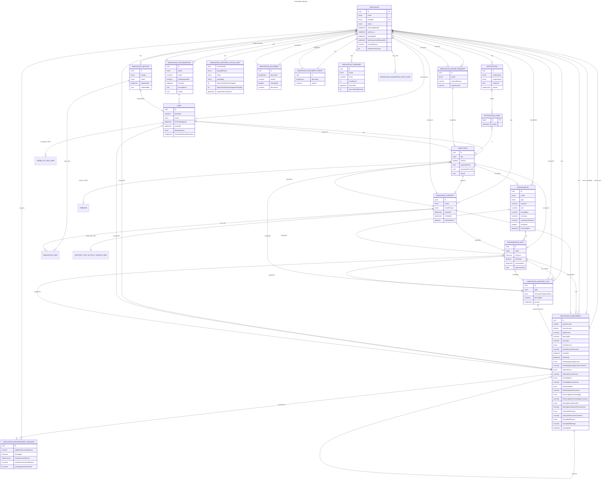

```mermaid
---
title: Innovation Service
---
erDiagram
  INNOVATION {
    uuid id PK
    string name
    string uniqueId UK
    enum status
    datetime2 statusUpdatedAt
    datetime2 expires_at
    datetime2 submittedAt
    datetime2 lastAssessmentRequestAt
    nvarchar archiveReason
    bit hasBeenAssessed
  }
  USER {
    uuid id
    nvarchar identityId
    enum status
    datetime2 firstTimeSignInAt
    datetime2 lockedAt
    enum deleteReason
    simple-json howDidYouFindUsAnswers
  }
  INNOVATION_COLLABORATOR {
    uuid id
    enum status
    nvarchar email
    nvarchar collaboratorRole
    datetime2 invitedAt
    uuid innovationId
    uuid userId
  }
  USER_ROLE {
    uuid id
    enum role
    boolean isActive
    uuid organisationId
    uuid organisationUnitId
    uuid userId
  }
  ORGANISATION {
    uuid id
    string name
    enum type
    nvarchar acronym
    nvarchar size
    nvarchar description
    nvarchar summary
    nvarchar registrationNumber
    boolean isShadow
    datetime2 inactivatedAt
  }
  ORGANISATION_UNIT {
    uuid id
    string name
    nvarchar acronym
    boolean isShadow
    datetime2 inactivatedAt
    uuid organisationId
  }
  INNOVATION_ASSESSMENT {
    uuid id
    smallint majorVersion
    smallint minorVersion
    nvarchar editReason
    nvarchar description
    nvarchar summary
    enum maturityLevel
    nvarchar maturityLevelComment
    datetime2 startedAt
    datetime2 finishedAt
    enum hasRegulatoryApprovals
    nvarchar hasRegulatoryApprovalsComment
    enum hasEvidence
    nvarchar hasEvidenceComment
    enum hasValidation
    nvarchar hasValidationComment
    enum hasProposition
    nvarchar hasPropositionComment
    enum hasCompetitionKnowledge
    nvarchar hasCompetitionKnowledgeComment
    enum hasImplementationPlan
    nvarchar hasImplementationPlanComment
    enum hasScaleResource
    nvarchar hasScaleResourceComment
    enum exemptedReason
    nvarchar exemptedMessage
    datetime2 exemptedAt
  }
  INNOVATION_REASSESSMENT_REQUEST {
    uuid id
    varchar updatedInnovationRecord
    nvarchar description
    simple-array reassessmentReason
    nvarchar otherReassessmentReason
    nvarchar whatSupportDoYouNeed
  }
  INNOVATION_SECTION {
    uuid id
    enum section
    enum status
    datetime2 submittedAt
    uuid submittedBy
  }
  INNOVATION_SUPPORT {
    uuid id
    enum status
    enum closeReason
    datetime2 startedAt
    datetime2 finishedAt
    boolean isMostRecent
  }
  INNOVATION_SUPPORT_LOG {
    uuid id
    enum type
    enum innovationSupportStatus
    nvarchar description
    simple-json params
  }
  NOTIFICATION {
    uuid id
    enum contextType
    enum contextDetail
    uuid contextId
    simple-json params
  }
  NOTIFICATION_USER {
    bigint id PK
    datetime2 readAt
  }
  INNOVATION_EXPORT_REQUEST {
    uuid id
    enum status
    varchar requestReason
    varchar rejectReason
  }
  INNOVATION_GROUPED_STATUS_VIEW {
    uuid innovationId
    enum groupedStatus
    string name
    string createdBy
    int daysSinceNoActiveSupport
    int daysSinceNoActiveSupportOrDeploy
    datetime2 expectedArchiveDate
  }
  INNOVATION_DOCUMENT {
    uuid id
    simple-json document
    nvarchar version
    boolean isSnapshot
    nvarchar description
  }
  INNOVATION_DOCUMENT_DRAFT {
    uuid id
    simple-json document
    nvarchar version
  }
  INNOVATION_TRANSFER {
    uuid id
    enum status
    nvarchar email
    int emailCount
    datetime2 finishedAt
    bit ownerToCollaborator
  }
  INNOVATION ||--o| USER : hasAnOwner
  INNOVATION ||--o{ ORGANISATION : sharedWith
  INNOVATION ||--o| INNOVATION_ASSESSMENT : hasCurrent
  INNOVATION ||--o| INNOVATION_ASSESSMENT : hasCurrentMajor
  INNOVATION ||--o{ INNOVATION_ASSESSMENT : has
  INNOVATION ||--o{ INNOVATION_SECTION : has
  INNOVATION ||--o{ INNOVATION_SUPPORT : has
  INNOVATION ||--o{ INNOVATION_SUPPORT_LOG : has
  INNOVATION ||--o{ NOTIFICATION : has
  INNOVATION ||--o{ INNOVATION_REASSESSMENT_REQUEST : requests
  INNOVATION ||--o{ INNOVATION_EXPORT_REQUEST : requests
  INNOVATION ||--|| INNOVATION_GROUPED_STATUS_VIEW : has
  INNOVATION ||--o{ INNOVATION_COLLABORATOR : has
  INNOVATION ||--|| INNOVATION_DOCUMENT : has
  INNOVATION ||--|| INNOVATION_DOCUMENT_DRAFT : has
  INNOVATION ||--o{ INNOVATION_TRANSFER : has
  INNOVATION ||--o{ INNOVATION_SUGGESTED_UNITS_VIEW : has_todo
  INNOVATION_COLLABORATOR ||--o| USER : is
  INNOVATION_COLLABORATOR ||--o| INNOVATION : collaboratesWith
  USER ||--o{ USER_ROLE : has
  USER ||--o{ TERMS_OF_USE_USER : accepted_TODO
  USER_ROLE ||--o| USER : belongsTo
  USER_ROLE ||--o| ORGANISATION : belongsTo
  USER_ROLE ||--o| ORGANISATION_UNIT : belongsTo
  USER_ROLE ||--o| THREADS : follows_TODO
  USER_ROLE ||--o| INNOVATION_SUPPORT : supports
  ORGANISATION ||--o{ ORGANISATION_UNIT : has
  ORGANISATION_UNIT ||--o| ORGANISATION : belongsTo
  ORGANISATION_UNIT ||--o{ INNOVATION_ASSESSMENT : has
  ORGANISATION_UNIT ||--o{ INNOVATION_SUPPORT_LOG : has_TODO
  INNOVATION_ASSESSMENT ||--|| INNOVATION : belongsTo
  INNOVATION_ASSESSMENT ||--o| USER : assignedTo
  INNOVATION_ASSESSMENT ||--o{ ORGANISATION_UNIT : suggested
  INNOVATION_ASSESSMENT ||--o| INNOVATION_ASSESSMENT : previous
  INNOVATION_ASSESSMENT ||--o| INNOVATION_REASSESSMENT_REQUEST : createdFrom
  INNOVATION_SECTION ||--|| USER : submittedBy
  INNOVATION_SECTION ||--o{ INNOVATION_TASK : xpto_todo
  INNOVATION_SUPPORT ||--o| INNOVATION : belongsTo
  INNOVATION_SUPPORT ||--o| INNOVATION_ASSESSMENT : assessedBy
  INNOVATION_SUPPORT ||--o| ORGANISATION_UNIT : supportBy
  INNOVATION_SUPPORT ||--o{ USER_ROLE : supportBy
  INNOVATION_SUPPORT ||--o{ INNOVATION_TASK : has_todo
  INNOVATION_SUPPORT ||--|| SUPPORT_LAST_ACTIVITY_UPDATE_VIEW : lastActivity_todo
  INNOVATION_SUPPORT_LOG ||--|| INNOVATION : belongsTo
  INNOVATION_SUPPORT_LOG ||--|| INNOVATION_ASSESSMENT : majorAssessment
  INNOVATION_SUPPORT_LOG ||--o| ORGANISATION_UNIT : createdBy
  INNOVATION_SUPPORT_LOG ||--|| USER_ROLE : createdBy
  INNOVATION_SUPPORT_LOG ||--o{ ORGANISATION_UNIT : suggested
  NOTIFICATION ||--o{ NOTIFICATION_USER : notifies
  NOTIFICATION_USER }o--|| USER_ROLE : is
  INNOVATION_EXPORT_REQUEST ||--o| INNOVATION : belongsTo
  INNOVATION_EXPORT_REQUEST ||--o| USER_ROLE : createdBy
  INNOVATION_DOCUMENT ||--o| INNOVATION : belongsTo
  INNOVATION_DOCUMENT_DRAFT ||--o| INNOVATION : belongsTo
```
