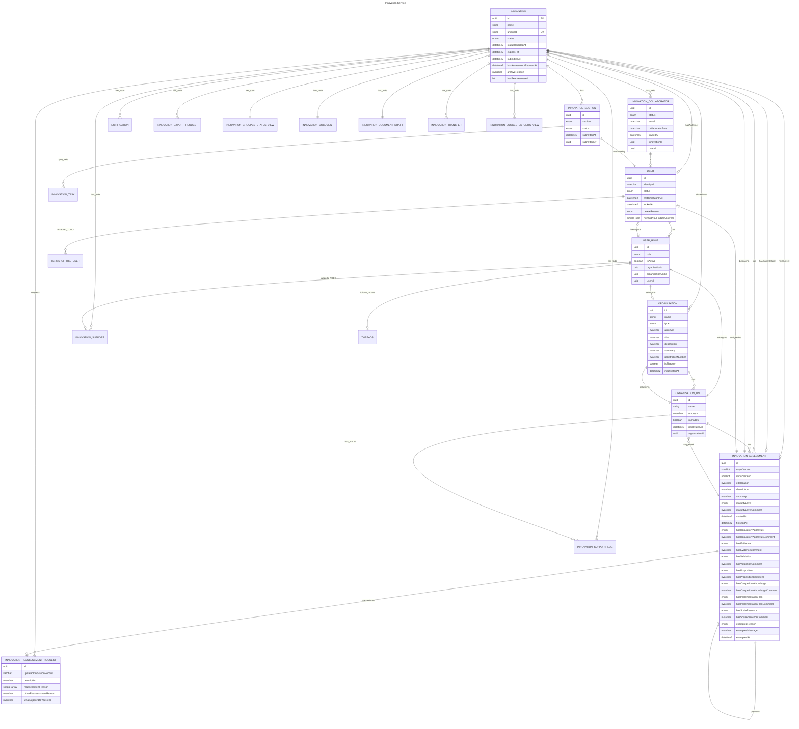

```mermaid
---
title: Innovation Service
---
erDiagram
  INNOVATION {
    uuid id PK
    string name
    string uniqueId UK
    enum status
    datetime2 statusUpdatedAt
    datetime2 expires_at
    datetime2 submittedAt
    datetime2 lastAssessmentRequestAt
    nvarchar archiveReason
    bit hasBeenAssessed
  }
  USER {
    uuid id
    nvarchar identityId
    enum status
    datetime2 firstTimeSignInAt
    datetime2 lockedAt
    enum deleteReason
    simple-json howDidYouFindUsAnswers
  }
  INNOVATION_COLLABORATOR {
    uuid id
    enum status
    nvarchar email
    nvarchar collaboratorRole
    datetime2 invitedAt
    uuid innovationId
    uuid userId
  }
  USER_ROLE {
    uuid id
    enum role
    boolean isActive
    uuid organisationId
    uuid organisationUnitId
    uuid userId
  }
  ORGANISATION {
    uuid id
    string name
    enum type
    nvarchar acronym
    nvarchar size
    nvarchar description
    nvarchar summary
    nvarchar registrationNumber
    boolean isShadow
    datetime2 inactivatedAt
  }
  ORGANISATION_UNIT {
    uuid id
    string name
    nvarchar acronym
    boolean isShadow
    datetime2 inactivatedAt
    uuid organisationId
  }
  INNOVATION_ASSESSMENT {
    uuid id
    smallint majorVersion
    smallint minorVersion
    nvarchar editReason
    nvarchar description
    nvarchar summary
    enum maturityLevel
    nvarchar maturityLevelComment
    datetime2 startedAt
    datetime2 finishedAt
    enum hasRegulatoryApprovals
    nvarchar hasRegulatoryApprovalsComment
    enum hasEvidence
    nvarchar hasEvidenceComment
    enum hasValidation
    nvarchar hasValidationComment
    enum hasProposition
    nvarchar hasPropositionComment
    enum hasCompetitionKnowledge
    nvarchar hasCompetitionKnowledgeComment
    enum hasImplementationPlan
    nvarchar hasImplementationPlanComment
    enum hasScaleResource
    nvarchar hasScaleResourceComment
    enum exemptedReason
    nvarchar exemptedMessage
    datetime2 exemptedAt
  }
  INNOVATION_REASSESSMENT_REQUEST {
    uuid id
    varchar updatedInnovationRecord
    nvarchar description
    simple-array reassessmentReason
    nvarchar otherReassessmentReason
    nvarchar whatSupportDoYouNeed
  }
  INNOVATION_SECTION {
    uuid id
    enum section
    enum status
    datetime2 submittedAt
    uuid submittedBy
  }
  INNOVATION ||--o| USER : hasAnOwner
  INNOVATION ||--o{ ORGANISATION : sharedWith
  INNOVATION ||--o| INNOVATION_ASSESSMENT : hasCurrent
  INNOVATION ||--o| INNOVATION_ASSESSMENT : hasCurrentMajor
  INNOVATION ||--o{ INNOVATION_ASSESSMENT : has
  INNOVATION ||--o{ INNOVATION_SECTION : has
  INNOVATION ||--o{ INNOVATION_SUPPORT : has_todo
  INNOVATION ||--o{ INNOVATION_SUPPORT_LOG : has_todo
  INNOVATION ||--o{ NOTIFICATION : has_todo
  INNOVATION ||--o{ INNOVATION_REASSESSMENT_REQUEST : requests
  INNOVATION ||--o{ INNOVATION_EXPORT_REQUEST : has_todo
  INNOVATION ||--|| INNOVATION_GROUPED_STATUS_VIEW : has_todo
  INNOVATION ||--o{ INNOVATION_COLLABORATOR : has_todo
  INNOVATION ||--|| INNOVATION_DOCUMENT : has_todo
  INNOVATION ||--|| INNOVATION_DOCUMENT_DRAFT : has_todo
  INNOVATION ||--o{ INNOVATION_TRANSFER : has_todo
  INNOVATION ||--o{ INNOVATION_SUGGESTED_UNITS_VIEW : has_todo
  INNOVATION_COLLABORATOR ||--o| USER : is
  USER ||--o{ USER_ROLE : has
  USER ||--o{ TERMS_OF_USE_USER : accepted_TODO
  USER_ROLE ||--o| USER : belongsTo
  USER_ROLE ||--o| ORGANISATION : belongsTo
  USER_ROLE ||--o| ORGANISATION_UNIT : belongsTo
  USER_ROLE ||--o| THREADS : follows_TODO
  USER_ROLE ||--o| INNOVATION_SUPPORT : supports_TODO
  ORGANISATION ||--o{ ORGANISATION_UNIT : has
  ORGANISATION_UNIT ||--o| ORGANISATION : belongsTo
  ORGANISATION_UNIT ||--o{ INNOVATION_ASSESSMENT : has
  ORGANISATION_UNIT ||--o{ INNOVATION_SUPPORT_LOG : has_TODO
  INNOVATION_ASSESSMENT ||--|| INNOVATION : belongsTo
  INNOVATION_ASSESSMENT ||--o| USER : assignedTo
  INNOVATION_ASSESSMENT ||--o{ ORGANISATION_UNIT : suggested
  INNOVATION_ASSESSMENT ||--o| INNOVATION_ASSESSMENT : previous
  INNOVATION_ASSESSMENT ||--o| INNOVATION_REASSESSMENT_REQUEST : createdFrom
  INNOVATION_SECTION ||--|| USER : submittedBy
  INNOVATION_SECTION ||--o{ INNOVATION_TASK : xpto_todo
```
