```mermaid
---
title: Innovation Service
---
erDiagram
  
  USER {
    uuid id
    nvarchar identityId
    enum status
    datetime2 firstTimeSignInAt
    datetime2 lockedAt
    enum deleteReason
    simple-json howDidYouFindUsAnswers
  }
  
  USER_ROLE {
    uuid id
    enum role
    boolean isActive
    uuid organisationId
    uuid organisationUnitId
    uuid userId
  }
  ORGANISATION {
    uuid id
    string name
    enum type
    nvarchar acronym
    nvarchar size
    nvarchar description
    nvarchar summary
    nvarchar website
    nvarchar registrationNumber
    boolean isShadow
    datetime2 inactivatedAt
  }
  ORGANISATION_UNIT {
    uuid id
    string name
    nvarchar acronym
    boolean isShadow
    datetime2 inactivatedAt
    uuid organisationId
  }
  
  INNOVATION_REASSESSMENT_REQUEST {
    uuid id
    varchar updatedInnovationRecord
    nvarchar description
    simple-array reassessmentReason
    nvarchar otherReassessmentReason
    nvarchar whatSupportDoYouNeed
  }
  INNOVATION_SECTION {
    uuid id
    enum section
    enum status
    datetime2 submittedAt
    uuid submittedBy
  }
  INNOVATION_SUPPORT {
    uuid id
    enum status
    enum closeReason
    datetime2 startedAt
    datetime2 finishedAt
    boolean isMostRecent
  }
  INNOVATION_SUPPORT_LOG {
    uuid id
    enum type
    enum innovationSupportStatus
    nvarchar description
    simple-json params
  }
  NOTIFICATION {
    uuid id
    enum contextType
    enum contextDetail
    uuid contextId
    simple-json params
  }
  NOTIFICATION_USER {
    bigint id PK
    datetime2 readAt
  }
  INNOVATION_EXPORT_REQUEST {
    uuid id
    enum status
    varchar requestReason
    varchar rejectReason
  }
  INNOVATION_GROUPED_STATUS_VIEW {
    uuid innovationId
    enum groupedStatus
    string name
    string createdBy
    int daysSinceNoActiveSupport
    int daysSinceNoActiveSupportOrDeploy
    datetime2 expectedArchiveDate
  }
  
  INNOVATION_TRANSFER {
    uuid id
    enum status
    nvarchar email
    int emailCount
    datetime2 finishedAt
    bit ownerToCollaborator
  }
  INNOVATION_SUGGESTED_UNITS_VIEW {
    uuid innovationId
    uuid suggestedUnitId
    simple-json suggestedBy
    datetime2 suggestedOn
  }
  TERMS_OF_USE_USER {
    uuid id PK
    datetime2 acceptedAt
  }
  INNOVATION_THREAD {
    uuid id
    string subject
    enum contextType
    uuid contextId
  }
  INNOVATION_THREAD_MESSAGE {
    uuid id
    nvarchar message
    bit isEditable
  }
  INNOVATION_TASK {
    uuid id
    nvarchar displayId
    enum status
  }
  INNOVATION_TASK_DESCRIPTIONS_VIEW {
    uuid taskId
    enum status
    uuid threadId
    uuid messageId
    nvarchar description
    datetime2 createdAt
    enum createdByRole
    nvarchar createdByIdentityId
    nvarchar createdByOrganisationUnitName
  }
  SUPPORT_LAST_ACTIVITY_UPDATE_VIEW {
    uuid supportId
    uuid innovationId
    uuid organisationUnitId
    datetime2 lastUpdate
  }
  TERMS_OF_USE {
    uuid id PK
    string name
    enum touType
    nvarchar summary
    datetime2 releasedAt
  }
  USER ||--o{ USER_ROLE : has
  USER ||--o{ TERMS_OF_USE_USER : accepted
  USER_ROLE ||--o| USER : belongsTo
  USER_ROLE ||--o| ORGANISATION : belongsTo
  USER_ROLE ||--o| ORGANISATION_UNIT : belongsTo
  USER_ROLE ||--o| INNOVATION_THREAD : follows
  USER_ROLE ||--o| INNOVATION_SUPPORT : supports
  ORGANISATION ||--o{ ORGANISATION_UNIT : has
  ORGANISATION_UNIT ||--o| ORGANISATION : belongsTo
  ORGANISATION_UNIT ||--o{ INNOVATION_ASSESSMENT : has
  ORGANISATION_UNIT ||--o{ INNOVATION_SUPPORT_LOG : has
  
  INNOVATION_SECTION ||--|| USER : submittedBy
  INNOVATION_SECTION ||--o{ INNOVATION_TASK : has
  INNOVATION_SUPPORT ||--o| INNOVATION : belongsTo
  INNOVATION_SUPPORT ||--o| INNOVATION_ASSESSMENT : assessedBy
  INNOVATION_SUPPORT ||--o| ORGANISATION_UNIT : supportBy
  INNOVATION_SUPPORT ||--o{ USER_ROLE : supportBy
  INNOVATION_SUPPORT ||--o{ INNOVATION_TASK : has
  INNOVATION_SUPPORT ||--|| SUPPORT_LAST_ACTIVITY_UPDATE_VIEW : lastActivity
  INNOVATION_SUPPORT_LOG ||--|| INNOVATION : belongsTo
  INNOVATION_SUPPORT_LOG ||--|| INNOVATION_ASSESSMENT : majorAssessment
  INNOVATION_SUPPORT_LOG ||--o| ORGANISATION_UNIT : createdBy
  INNOVATION_SUPPORT_LOG ||--|| USER_ROLE : createdBy
  INNOVATION_SUPPORT_LOG ||--o{ ORGANISATION_UNIT : suggested
  NOTIFICATION ||--o{ NOTIFICATION_USER : notifies
  NOTIFICATION_USER }o--|| USER_ROLE : is
  INNOVATION_EXPORT_REQUEST ||--o| INNOVATION : belongsTo
  INNOVATION_EXPORT_REQUEST ||--o| USER_ROLE : createdBy
  INNOVATION_SUGGESTED_UNITS_VIEW ||--o| INNOVATION : belongsTo
  INNOVATION_SUGGESTED_UNITS_VIEW ||--o| ORGANISATION_UNIT : suggestedUnit
  TERMS_OF_USE_USER ||--o| USER : acceptedBy
  TERMS_OF_USE_USER ||--o| TERMS_OF_USE : accepted
  INNOVATION_THREAD ||--o| INNOVATION : belongsTo
  INNOVATION_THREAD ||--o| USER : authoredBy
  INNOVATION_THREAD ||--o| USER_ROLE : authoredBy
  INNOVATION_THREAD ||--o{ USER_ROLE : followedBy
  INNOVATION_THREAD ||--o{ INNOVATION_THREAD_MESSAGE : contains
  INNOVATION_THREAD_MESSAGE ||--o| INNOVATION_THREAD : belongsTo
  INNOVATION_THREAD_MESSAGE ||--o| USER : authoredBy
  INNOVATION_THREAD_MESSAGE ||--o| USER_ROLE : authoredBy
  INNOVATION_THREAD_MESSAGE ||--o| ORGANISATION_UNIT : authoredBy
  INNOVATION_TASK ||--o| INNOVATION_SECTION : belongsTo
  INNOVATION_TASK ||--o| INNOVATION_SUPPORT : belongsTo
  INNOVATION_TASK ||--o| USER_ROLE : createdBy
  INNOVATION_TASK ||--o| USER_ROLE : updatedBy
  INNOVATION_TASK ||--o{ INNOVATION_TASK_DESCRIPTIONS_VIEW : has
  INNOVATION_TASK_DESCRIPTIONS_VIEW ||--o| INNOVATION_TASK : belongsTo

  ACTIVITY_LOG {
    uuid id PK
    enum type
    enum activity
    simple-json param
    uuid userRoleId FK
    uuid innovationId FK
  }
  ACTIVITY_LOG ||--o| USER_ROLE : createdBy
  ACTIVITY_LOG ||--o| INNOVATION : belongsTo

  ANNOUNCEMENT {
    uuid id PK
    enum status
    nvarchar title
    simple-array userRoles
    datetime2 startsAt
    datetime2 expiresAt
    simple-json params
    enum type
    simple-json filters
    bit sendEmail
  }
  ANNOUNCEMENT_USER {
    uuid id PK
    datetime2 readAt
    uuid announcementId FK
    uuid userId FK
    uuid innovationId FK
  }
  ANNOUNCEMENT ||--o{ ANNOUNCEMENT_USER : has
  ANNOUNCEMENT_USER ||--o| ANNOUNCEMENT : belongsTo
  ANNOUNCEMENT_USER ||--o| USER : is
  ANNOUNCEMENT_USER ||--o| INNOVATION : belongsTo

  AUDIT {
    uuid id PK
    uuid userId FK
    datetime2 date
    enum action
    enum target
    uuid targetId
    uuid innovationId FK
    nvarchar invocationId
    nvarchar functionName
  }
  AUDIT ||--o| USER_ROLE : createdBy
  AUDIT ||--o| INNOVATION : belongsTo

  INNOVATION {
    uuid id PK
    string name
    string uniqueId UK
    enum status
    datetime2 statusUpdatedAt
    datetime2 expires_at
    datetime2 submittedAt
    datetime2 lastAssessmentRequestAt
    nvarchar archiveReason
    bit hasBeenAssessed
    uuid ownerId FK
    uuid currentAssessmentId FK
    uuid currentMajorAssessmentId FK
  }
  INNOVATION ||--o| USER : hasAnOwner
  INNOVATION ||--o{ ORGANISATION : sharedWith
  INNOVATION ||--o| INNOVATION_ASSESSMENT : hasCurrent
  INNOVATION ||--o| INNOVATION_ASSESSMENT : hasCurrentMajor
  INNOVATION ||--o{ INNOVATION_ASSESSMENT : has
  INNOVATION ||--o{ INNOVATION_SECTION : has
  INNOVATION ||--o{ INNOVATION_SUPPORT : has
  INNOVATION ||--o{ INNOVATION_SUPPORT_LOG : has
  INNOVATION ||--o{ NOTIFICATION : has
  INNOVATION ||--o{ INNOVATION_REASSESSMENT_REQUEST : requests
  INNOVATION ||--o{ INNOVATION_EXPORT_REQUEST : requests
  INNOVATION ||--|| INNOVATION_GROUPED_STATUS_VIEW : has
  INNOVATION ||--o{ INNOVATION_COLLABORATOR : has
  INNOVATION ||--|| INNOVATION_DOCUMENT : has
  INNOVATION ||--|| INNOVATION_DOCUMENT_DRAFT : has
  INNOVATION ||--o{ INNOVATION_TRANSFER : has
  INNOVATION ||--o{ INNOVATION_SUGGESTED_UNITS_VIEW : suggested
  
  INNOVATION_ASSESSMENT {
    uuid id PK
    smallint majorVersion
    smallint minorVersion
    nvarchar editReason
    nvarchar description
    nvarchar summary
    enum maturityLevel
    nvarchar maturityLevelComment
    datetime2 startedAt
    datetime2 finishedAt
    enum hasRegulatoryApprovals
    nvarchar hasRegulatoryApprovalsComment
    enum hasEvidence
    nvarchar hasEvidenceComment
    enum hasValidation
    nvarchar hasValidationComment
    enum hasProposition
    nvarchar hasPropositionComment
    enum hasCompetitionKnowledge
    nvarchar hasCompetitionKnowledgeComment
    enum hasImplementationPlan
    nvarchar hasImplementationPlanComment
    enum hasScaleResource
    nvarchar hasScaleResourceComment
    enum exemptedReason
    nvarchar exemptedMessage
    datetime2 exemptedAt
    uuid innovationId FK
    uuid assignTo FK
    uuid previousAssessmentId FK
  }
  INNOVATION_ASSESSMENT_ORGANISATION_UNIT {
    uuid innovationAssessmentId PK,FK
    uuid organisationUnitId PK,FK
  }
  INNOVATION_ASSESSMENT ||--|| INNOVATION : assesses
  INNOVATION_ASSESSMENT ||--o| USER : assignedTo
  INNOVATION_ASSESSMENT ||--o| INNOVATION_ASSESSMENT : previous
  INNOVATION_ASSESSMENT ||--o| INNOVATION_REASSESSMENT_REQUEST : createdFrom
  INNOVATION_ASSESSMENT ||--o{ INNOVATION_ASSESSMENT_ORGANISATION_UNIT : suggested
  INNOVATION_ASSESSMENT_ORGANISATION_UNIT ||--|| ORGANISATION_UNIT: suggested
  INNOVATION_ASSESSMENT_ORGANISATION_UNIT ||--|| INNOVATION_ASSESSMENT: belongsTo

  INNOVATION_COLLABORATOR {
    uuid id PK
    enum status
    nvarchar email
    nvarchar collaboratorRole
    datetime2 invitedAt
    uuid innovationId FK
    uuid userId FK
  }
  INNOVATION_COLLABORATOR ||--o| USER : is
  INNOVATION_COLLABORATOR ||--o| INNOVATION : collaboratesWith
  
  INNOVATION_DOCUMENT {
    uuid id PK,FK
    simple-json document
    nvarchar version
    boolean isSnapshot
    nvarchar description
  }
  INNOVATION_DOCUMENT_DRAFT {
    uuid id PK,FK
    simple-json document
    nvarchar version
  }
  INNOVATION_DOCUMENT ||--o| INNOVATION : belongsTo
  INNOVATION_DOCUMENT_DRAFT ||--o| INNOVATION : belongsTo
  
  
```

# Innovation Document Schema
TODO

# Deprecated only here for audit/history
- innovation_action: replaced by innovation_tasks
- replaced by innovation_document: 
  - innovation_area
  - innovation_care_setting
  - innovation_category
  - innovation_clinical_area
  - innovation_deployment_plan
  - innovation_disease_condition

- lots of columns, especially within the innovation entity that were replaced by the innovation_document