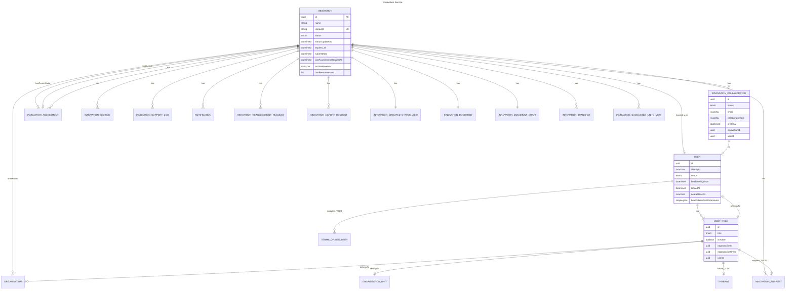

```mermaid
---
title: Innovation Service
---
erDiagram
  INNOVATION {
    uuid id PK
    string name
    string uniqueId UK
    enum status
    datetime2 statusUpdatedAt
    datetime2 expires_at
    datetime2 submittedAt
    datetime2 lastAssessmentRequestAt
    nvarchar archiveReason
    bit hasBeenAssessed
  }
  USER {
    uuid id
    nvarchar identityId
    enum status
    datetime2 firstTimeSignInAt
    datetime2 lockedAt
    nvarchar deleteReason
    simple-json howDidYouFindUsAnswers
  }
  INNOVATION_COLLABORATOR {
    uuid id
    enum status
    nvarchar email
    nvarchar collaboratorRole
    datetime2 invitedAt
    uuid innovationId
    uuid userId
  }
  USER_ROLE {
    uuid id
    enum role
    boolean isActive
    uuid organisationId
    uuid organisationUnitId
    uuid userId
  }
  INNOVATION ||--o| USER : hasAnOwner
  INNOVATION ||--o{ ORGANISATION : sharedWith
  INNOVATION ||--o| INNOVATION_ASSESSMENT : hasCurrent
  INNOVATION ||--o| INNOVATION_ASSESSMENT : hasCurrentMajor
  INNOVATION ||--o{ INNOVATION_ASSESSMENT : has
  INNOVATION ||--o{ INNOVATION_SECTION : has
  INNOVATION ||--o{ INNOVATION_SUPPORT : has
  INNOVATION ||--o{ INNOVATION_SUPPORT_LOG : has
  INNOVATION ||--o{ NOTIFICATION : has
  INNOVATION ||--o{ INNOVATION_REASSESSMENT_REQUEST : has
  INNOVATION ||--o{ INNOVATION_EXPORT_REQUEST : has
  INNOVATION ||--|| INNOVATION_GROUPED_STATUS_VIEW : has
  INNOVATION ||--o{ INNOVATION_COLLABORATOR : has
  INNOVATION ||--|| INNOVATION_DOCUMENT : has
  INNOVATION ||--|| INNOVATION_DOCUMENT_DRAFT : has
  INNOVATION ||--o{ INNOVATION_TRANSFER : has
  INNOVATION ||--o{ INNOVATION_SUGGESTED_UNITS_VIEW : has
  INNOVATION_COLLABORATOR ||--o| USER : is
  USER ||--o{ USER_ROLE : has
  USER ||--o{ TERMS_OF_USE_USER : accepted_TODO
  USER_ROLE ||--o| USER : belongsTo
  USER_ROLE ||--o| ORGANISATION : belongsTo
  USER_ROLE ||--o| ORGANISATION_UNIT : belongsTo
  USER_ROLE ||--o| THREADS : follows_TODO
  USER_ROLE ||--o| INNOVATION_SUPPORT : supports_TODO
```
